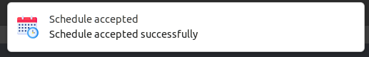

# Library gen2brain/beeep
[beeep](https://github.com/gen2brain/beeep) provides a cross-platform library for sending desktop notifications, alerts and beeps.

## Examples


```go
var err error
if err = beeep.Notify("Hello, World!", "Message body", "assets/hands.png"); err != nil {
  panic(err)
}
```



```go
var err error
if err = beeep.Alert("Schedule accepted", "Schedule accepted successfully", "assets/schedule.png"); err != nil {
  panic(err)
}
```

